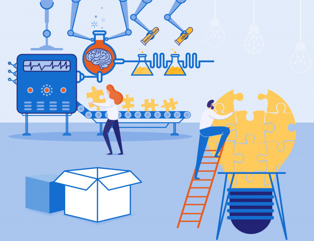

# LIBERAÇÕES CONTÍNUAS

A partir de agora, as alterações e/ ou correções do sistema passam a ser liberadas de forma mais frequente, o que chamaremos de "Distriuição contínua", agregando praticidade e agilidade perante as solicitações. Sendo assim, a liberação da versão passa a ser - representativamente - diária.

<!--  -->

**O que é distribuição contínua?**

A distribuição contínua é uma prática de desenvolvimento de software na qual as alterações de código são automaticamente preparadas para liberação na produção. É um pilar do desenvolvimento moderno e expande com base na integração contínua, implantando todas as alterações na produção, após o estágio de criação. 

**Seus benefícios**

Permite que seja possível verificar atualizações em várias dimensões antes de implantá-las. Isso ajuda a validar com maior precisão as atualizações e a descobrir problemas de modo preventivo, devido aos testes mais frequentes e abrangentes. 
A distribuição de software fica mais rápida, eficiente e estas práticas ajudam a sua empresa a ser mais produtiva, ajudando a reduzir o número de erros que surgem em decorrência da utilização do sistema por meio dos trabalhos vivenciados.

