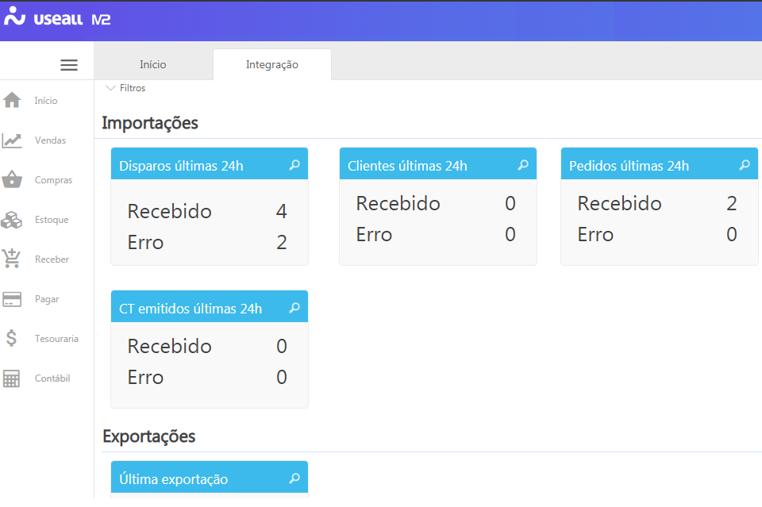
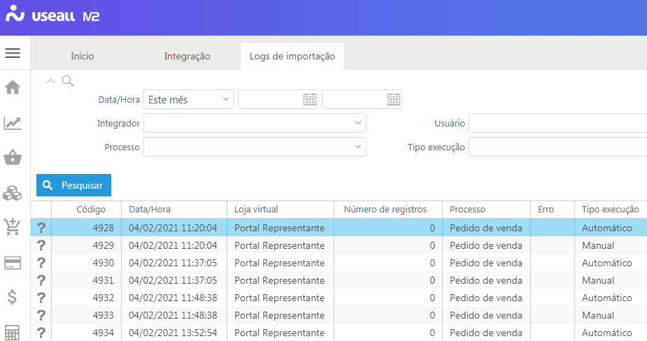
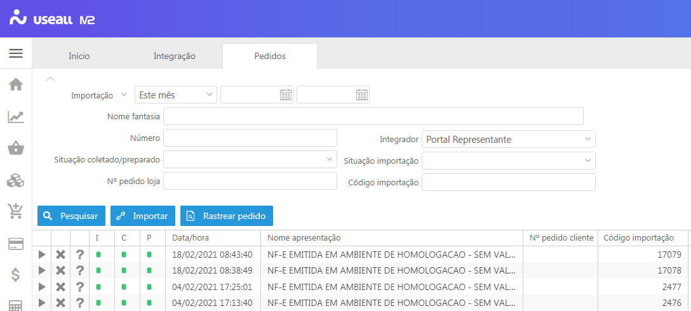

# MANUAL DE PROCEDIMENTOS M2

**1 Início**

Para utilização do sistema faz-se necessário a realização das configurações das funcionalidades para cada empresa/ filial. As informações serão inseridas pela nossa equipe de implantação juntamente com o representante do cliente, que descreverá o funcionamento de cada empresa/ filial para que sejam realizadas as devidas configurações. 

**Funcionalidades iniciais do sistema M2**

- [1.1 Integração](#1_1-integracao)
- [1.2 Listas](#1_2-listas)
- [1.3 Parametrização](#1_3-parametrizacao)

_____________________________

_____________________________

# 
**1.1 Integração**

Neste processo são demonstradas as informações integradas com o sistema "Portal do representante". Para visualizar as informações, basta clicar na lupa, demonstrada no cabeçalho de cada painel de visualização.  

> IMPORTANTE: para que as informações sejam demonstradas, o parâmetro "[Habilitar/Desabilitar portal do fornecedor](#habilitar-desabilitar-portal-do-fornecedor), localizado em "Início > Parametrização", deve ser configurado.

**
<i>[Voltar ao topo](#manual-de-procedimentos-m2)</i>
**

### **<u>Disparos últimas 24h</u>**

Ao acessar esta opção, serão demonstradas as informações referentes deste processo, a tela será demonstrada com as informações das importações, sejam elas manuais ou automáticas.

 

### **<u>Clientes últimas 24h</u>**

### **<u>Pedidos últimas 24h</u>**

 

### **<u>CT emitidos últimas 24h</u>**

### **<u>Última exportação</u>**

## 
**1.2 Listas**

Opções descritas ao clicar no botão "Listas".

[1.2.1 Setores](#1_2_1-setores) 
[1.2.2 Campos livres](#1_2_2-campos-livres) 
[1.2.3 Cidades](#1_2_3-cidades) 
[1.2.4 Empresas](#1_2_4-empresas) 
[Filiais](#filiais) 
[Motivos de operação](#motivos-de-operacao) 
[Países](#paises) 
[Regiões](#regioes) 
[UF](#uf) 
[Etiquetas](#etiquetas) 
[Estações de trabalho](#estacoes-de-trabalho) 
[Impressoras](#impressoras) 
[Equipamentos seriais](#equipamentos-seriais) 
[Caixa de entrada](#caixa-de-entrada) 
[Moedas](#moedas) 
[Cotações](#cotacoes) 
[Mensagens](#mensagens) 
[Restrições](#restricoes)  
[Tipos de anexo do portal do representante](#tipos-de-anexo-do-portal-do-representante) 

## **Setores**

Este processo compreende o cadastro de registros que serão visualizados em.....

Para cadastrar um novo registro, clique no botão "Novo", informe o campo "Descrição" e clique no botão "Salvar".

## 
**1.3 Parametrização**

As parametrizações são as configurações a serem realizadas para uma determinada funcionalidade do sistema. Essas configurações alteram a forma da utilização do sistema.

**<u>Abrangência dos parâmetros</u>:** esta opção pode ser utilizada para visualização dos parâmetros conforme conforme a escolha realizada e informação descrita no campo "Pesquisa".

**<u>Pesquisa...</u>:** utilize este campo para buscar informação desejada utilizando a descrição completa ou parte da descrição.

Os parâmetros são separados por módulo para melhor organização das informações. Clique na opção desejada para visualização das informações.

Comum 
Fiscal 
Compras 
[1.3.4 Vendas](#1_3_4-vendas) 
Estoque 
[1.3.6 Contas a receber](#1_3_6-contas-a-receber)
Contas a pagar 
Tesouraria 
Contabilidade  

## 
**1.3.4 Vendas**

Condição de pagamento
[1.3.4.1 Cobrar IPI na primeira parcela]()
[1.3.4.2 Cobrar retenção do ICMS ST na primeira parcela (ST com destaque na NF)]() 
[1.3.4.3 Cobrar antecipação do ICMS ST na primeira parcela (ST sem destaque na NF)]() 
[1.3.4.4 Cobrar outras despesas na primeira parcela]() 
[1.3.4.5 Cobrar frete na primeira parcela]() 
[1.3.4.6 Cobrar seguro na primeira parcela]()

Portal do representante 
[1.3.4.7 Configuração do espelho]() 
[1.3.4.8 Configuração de campos do cadastro do cliente]() 

Vendas 
[1.3.4.9 Adiantamento de pedidos]() 
[1.3.4.10 Controle de numeração dos processos]() 
[1.3.4.11 Tabela de preços de venda]() 
[1.3.4.12 Analisar crédito no pedido de venda]() 
[1.3.4.13 Análise comercial]() 
[1.3.4.14 Custo para cálculo da margem]() 
[1.3.4.15 Reservar estoque no pedido]() 
[1.3.4.16 Dias válidos para vencimento dos títulos]() 
[1.3.4.17 Atualizar data e hora de saída da nota fiscal]() 
[1.3.4.18 Tipo de contas a receber das notas fiscais]() 
[1.3.4.19 Tipo de contas a receber para notas de crédito das notas fiscais]() 
[1.3.4.20 Natureza financeira para venda]() 
[1.3.4.21 Natureza financeira para devolução]() 
[1.3.4.22 Controle de comissão nas vendas]() 
[1.3.4.23 Forma de cálculo da unidade tributável]() 
[1.3.4.24 Forma de cálculo para formação de preços]() 
[1.3.4.25 Forma de cálculo para orçamento]() 
[1.3.4.26 Fechamento de comissões]() 
[1.3.4.27 Prazo de entrega padrão]() 

[1.3.4.38 Ordem de faturamento dos itens](#1_3_4_38-ordem-fat-itens) 

## 
1.3.4.38 Ordem de faturamento dos itens

Este parâmetro descreve a maneira com que serão organizados os itens na demonstração dos espelhos do [pedido](#INSERIR_AQUI_O_LINK_DAS_EXPLICACOES) e [nota fiscal de saída](#INSERIR_AQUI_O_LINK_DAS_EXPLICACOES), bem como [DANFE](#INSERIR_AQUI_O_LINK_DAS_EXPLICACOES) gerada pela autorização da NF.

# 
 1.3.6 Contas a receber 

