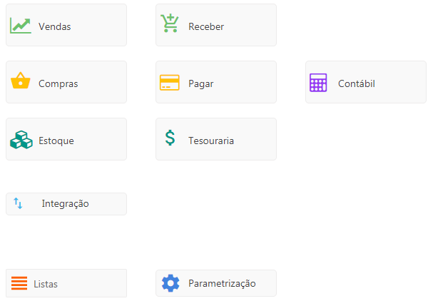

<!--**********************************************************************
##########################################################################
## Elaborado por      : Rafael Chagas       ######  Sprint: 09          ##
## Elaboração         : 12/02                                           ##
## -------------------------------------------------------------------- ##
##                              Descrição                               ##
## -------------------------------------------------------------------- ##
##                                                                      ##
##                                                                      ##
##########################################################################
***********************************************************************-->

# **Manual de procedimentos**

## Sistema Useall M2

Este manual tem como objetivo orientar os procedimentos de utilização e funcionamento do sistema Useall M2.net.  

## **Tela principal do sistema**

### Módulos

[Vendas](~/manual_proced_tecnico/Modulos/vendas.md) 
[Compras](~/manual_proced_tecnico/Modulos/compras.md) 
[Estoque](~/manual_proced_tecnico/Modulos/estoque.md) 
[Receber](~/manual_proced_tecnico/Modulos/receber.md) 
[Pagar](~/manual_proced_tecnico/Modulos/pagar.md) 
[Tesouraria](~/manual_proced_tecnico/Modulos/tesouraria.md) 
[Contábil](~/manual_proced_tecnico/Modulos/contabil.md) 

### Informações integradas

[Integração](#integracao)  

### Configuração geral do sistema

[Listas](#listas)  
[Parametrização](#parametrizacao) 

  
_____________________________

_____________________________

 <i>O conteúdo deste manual é disponibilizado para o uso técnico da empresa Useall Software, no intuito exclusivo de consulta para aprendizagem de utilização do sistema M2. É expressamente proibida a sua reprodução, aluguel ou a comercialização, sob pena de multa prevista contra os direitos autorais. Todos os títulos e direitos autorais relativos aos manuais dos sistemas Useall, incluindo todo o conteúdo e imagens, são de propriedade da Useall Software.</i>  

<i>**©USEALL SOFTWARE LTDA - versão 01/ 2021**</i>   

_____________________________

_____________________________

  

## Listas

Opções descritas ao clicar no botão "Listas".

[Setores](#setores)  
Campos livres  
Cidades  
Empresas  
Filiais  
Motivos de operação  
Países  
Regiões  
UF  
Etiquetas  
Estações de trabalho  
Impressoras  
Equipamentos seriais  
Caixa de entrada  
Moedas  
Cotações  
Mensagens  
Restrições   
Tipos de anexo do portal do representante  

## **Setores**

Este processo compreende o cadastro de registros que serão visualizados em.....

Para cadastrar um novo registro, clique no botão "Novo", informe o campo "Descrição" e clique no botão "Salvar".

## Parametrização

