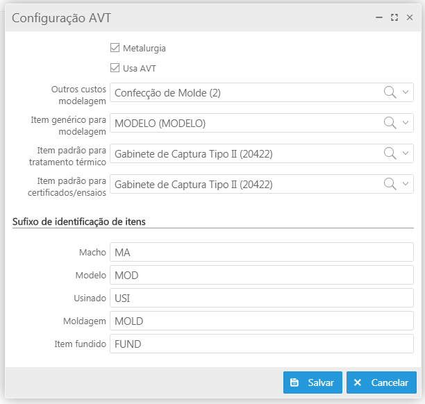
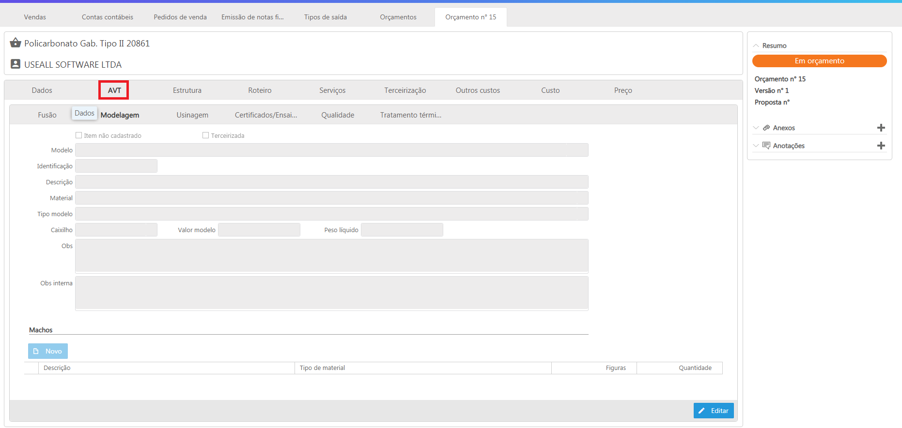

# Novidades da versão 2.0.8

Liberado em 30 de março 2020, a versão 2.0.8 com algumas alterações e correções.

* [AVT](#avt)
* [Faturamento](#faturamento)

## **Novas funcionalidades**

### **AVT** 

Análise de viabilidade técnica ou AVT, é uma funcionalidade disponibilizada no processo de Orçamento do M2 integrada ao M2 PCP com a finalidade de atender a necessidade, de empresas de Metalurgia, de criar um produto com características bem específicas da área. Por ser direcionado para esse tipo de empresa, o AVT é habilitado através da Parametrização "AVT" no módulo "Comum". A partir disso os seguintes campos são habilitados para utilização:

**Fusão:** Nessa aba informa-se os dados para fundição, como o peso bruto ou o Grau de dificuldade para a criação da peça;

**Modelagem:** Na aba "Modelagem" foi inserido a informação do molde que será utilizado para adicionar o metal derretido para criação da peça. Nela colocamos informações como "Material" ou "Modelo";

**Usinagem:** Tem por função indicar se a usinagem do item será realizada pela própria empresa ou por um serviço terceirizado, bem como a definição dos valores;

**Certificados/Ensaios:** Tem por função definir atividades que serão feitas pela própria empresa ou por um serviço terceirizado, bem como a definição dos valores;

**Qualidade:** Nesse campo o usuário insere informações mais técnicas relacionadas ao metal que será utilizado, com campos como "Densidade" ou "Resistência tração";

**Tratamento térmico:** Essa aba tem por função definir se o serviço de Tratamento térmico será feito pela própria empresa ou por serviço terceirizado, bem como a definição dos valores.

Quando habilitada na parametrização, a AVT aparece dentro do processo de orçamento integrada ao M2 PCP. 

### **Faturamento**

Disponibilizado o novo processo de faturamento, mais rápido, estável e prático, sem configurações adicionais para usar.

O acesso pode ser feito pela tela de consulta do pedido de venda, utilizando a ação Emitir nota fiscal (Faturamento novo) do botão Mais opções ou pela tile Emissão de notas fiscais no módulo Vendas. 

Na tela de consulta de Emissão de notas fiscais, é possível escolher o tipo de agrupamento para visualizar os pedidos:

- Agrupar por cliente
- Agrupar por transportadora
- Agrupar por carga 
- Agrupar por pedido
- Agrupar por usuário
- Agrupar por grupo empresarial

Se for preciso fazer um agrupamento diferente, é possível usar o campo Agrupamento. Por exemplo, caso tenha um mesmo pedido com dois itens e quiser emitir duas notas separadas, basta informar um número de agrupamento diferente para cada um desses itens.

> Essa regra não sobrepõe a regra de agrupamento do M2, portando só deve ser alterada, caso queira fazer um faturamento diferente e apenas nos itens que deseja fazer a mudança.

Tela de opções de agrupamento:

**1. Analisar após filtrar:**  o sistema irá avaliar, imediatamente após filtrar os pedidos, se existe alguma restrição. Ao marcar essa opção o sistema verifica as restrições 4, 5 e 6 (quando habilitadas), sem precisar clicar no botão "Analisar".

**2. Lançar como conferido:** Marcar essa opção se não usar embarque, dessa forma não será necessário usar a opção "Conferir", na tela de Emissão de notas. Se o item usa lote, será necessário acessar essa opção para digitar os lotes.

**3. Tributar a nota conforme o pedido:** Marcar essa opção para utilizar as alíquotas, CST e outros dados do pedido.

**4. Estoque disponível:** Marcar essa opção para o sistema considerar o estoque, para sugerir a coluna quantidade a faturar. Esse parâmetro funciona em conjunto com o tipo de saída, que deve estar marcado como "Movimenta estoque próprio".

**5. Quantidade mínima:** Marcar essa opção para o sitema considerar o campo quantidade mínima para venda, no cadatro do item. Se o pedido tiver saldo menor que a quantidade mínima ou se o estoque estiver abaixo da quantidade mínima para venda, será sugerido não faturar.

**6. Quantidade múltipla:** Marcar essa opção para o sistema considerar o campo quantidade por embalagem, no cadastro do item. O sistema vai sugerir faturar apenas quantidades que fechem volumes inteiros, por exemplo: Se o saldo do pedido é 7 e a quantidade por embalagem 6, será sugerido faturar apenas seis unidades. Caso o saldo não atinja uma quantidade múltipla, será sugerido não faturar. Esse parâmetro funciona em conjunto com o tipo de saída, que deve estar marcado para "Validar quantidade por embalagem".

**7. Agrupamento:** O M2 sempre sugere gerar uma nota fiscal nova para cada combinação de "Cliente+Transportadora+Condição de pagamento", portanto, quando houver um pedido para o mesmo cliente, mas transportadora diferente, serão geradas duas notas fiscais.
No caso de um pedido não conter transportadora, será agrupado e faturado com o pedido que contém transportadora.

"Grupo empresarial + Transportadora + Cond. pagto." - Configure essa opção para faturar para o grupo empresarial. O M2 permitirá gerar uma nota fiscal para clientes diferentes dentro do mesmo grupo. Na tela de emissão da NF poderá ser indicado para qual dos clientes a nota será faturada.

"Pedido" - Configurar para gerar uma nota para cada pedido de venda, mesmo quando houver pedidos para o mesmo cliente.

## **Outras Alterações**

**<u>PIS E COFINS**</u>  

Alterado o funcionamento do PIS e COFINS, onde passa a funcionar semelhante ao ICMS. O PIS e a COFINS poderão ser lançados na nota de entrada indiferente de crédito. Essa mudança foi feita para atender ao processo de importação. Na importação, o PIS e a COFINS precisam ser calculados, mesmo na hipótese de não haver crédito do imposto.

Para isso foram adicionados dois novos parâmetros no tipo de entrada, para definir se tem crédito de PIS e COFINS. Quando marcado, o M2 vai sugerir o crédito do PIS e da COFINS na nota de entrada, se houver crédito, o PIS e a COFINS diminuirão o custo do item.

---

**<u>Alteração na gestão de estoque**</u>

O processo de Requisição de material passa a ter duas modalidades: **Requisição de material** e **Requisição para transferência**.

Os processos de transferência de estoque foram descontinuados para favorecer o uso da requisição de transferência.

>Os benefícios dessa mudança são:

* Padronização do documento para gestão do estoque.
* Custo médio mais simples. O processo de transferência anterior aumentava consideravelmente a dificuldade em calcular e validar o custo médio.

**Requisição de material**

A requisição de material é o processo já conhecido, que baixa o estoque ao realizar o atendimento da requisição.

**Requisição para transferência**

A requisição de transferência faz a transferência de estoque do almoxarifado de origem para o almoxarifado de destino informado no lançamento da requisição de materiais. A operação é concretizada ao fazer o atendimento da requisição.

>É permitido fazer transferência desde que os almoxarifados de origem e destino tenham a mesma conta contábil.

**<u>Lançamentos contábeis**</u> 

Nos processos de contas a receber e pagar, ao visualizar o título, a aba contabilidade não será mais exibida. A partir dessa versão, é possível alterar e consultar o lançamento contábil dos títulos nas ações:

* Mais opções/Alterar/Lançamento contábil

  - Título: Para alterar o lançamento contábil original do título

  - Alteração de valor: Para aterar o lançamento contábil da operação de alteração de valor

* Mais opções/Consultar/Lote contábil

---

**<u>Melhorias nas configurações da tributação do M2**</u> 

**Exceção fiscal do ICMS:**  

* Adicionado os critérios **Contribuinte de ICMS** e **Consumidor final** 

* Adicionado o CFOP na Exceção fiscal do ICMS. Agora a exceção é capaz de redefinir o CFOP da nota fiscal. Isso é opcional, para não alterar basta deixar em branco. (Contábil > Listas > Exceção fiscal do ICMS)

**Substituição tributária do ICMS:** 

* Agora no cadastro de substituição tributária é permitido informar vários NCM.
* Também passou a ser possível configurar grupo tributário e NCM na mesma regra de substituição tributária. (Contábil > Listas > Substituição tributária)

**Redução da base de cálculo do ICMS:** 

* Para diminuir a necessidade de Exceções fiscais foi disponibilizada a configuração de **Redução da base de cálculo do ICMS**. Nessa configuração pode-se habilitar a redução da base de cálculo conforme os critérios disponíveis.
A redução é procesada pelo M2 logo após o tipo de saída ser determinado, por isso, as alterações posteriores a etapa de redução sobrepõe a redução. Por exemplo: se cadatrar uma exceção fiscal, ela será mais prioritária que a redução. (Contábil > Listas > Redução da base de cálculo do ICMS)

**Redução da base de cálculo do PIS e da COFINS:** 

A Exceção fiscal do PIS e da COFINS permite reduzir a base de cálculo dessas contribuções federais. (Contábil > Listas > Exceção fiscal do PIS/COFINS)

