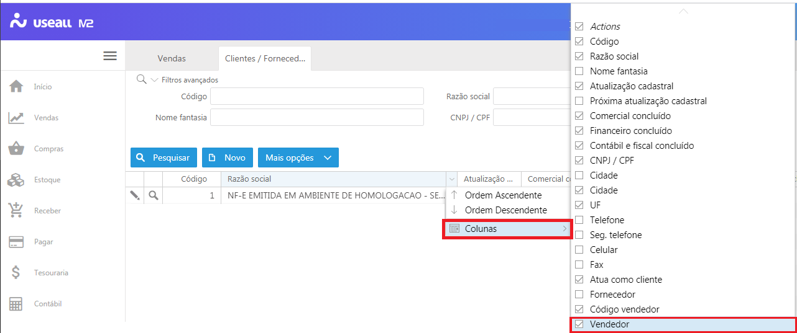
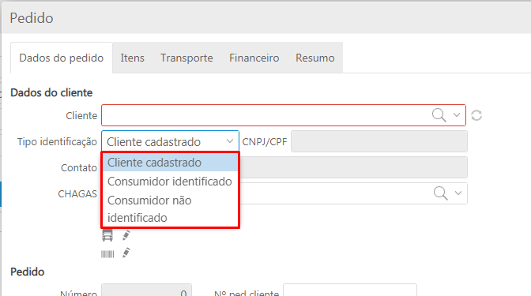
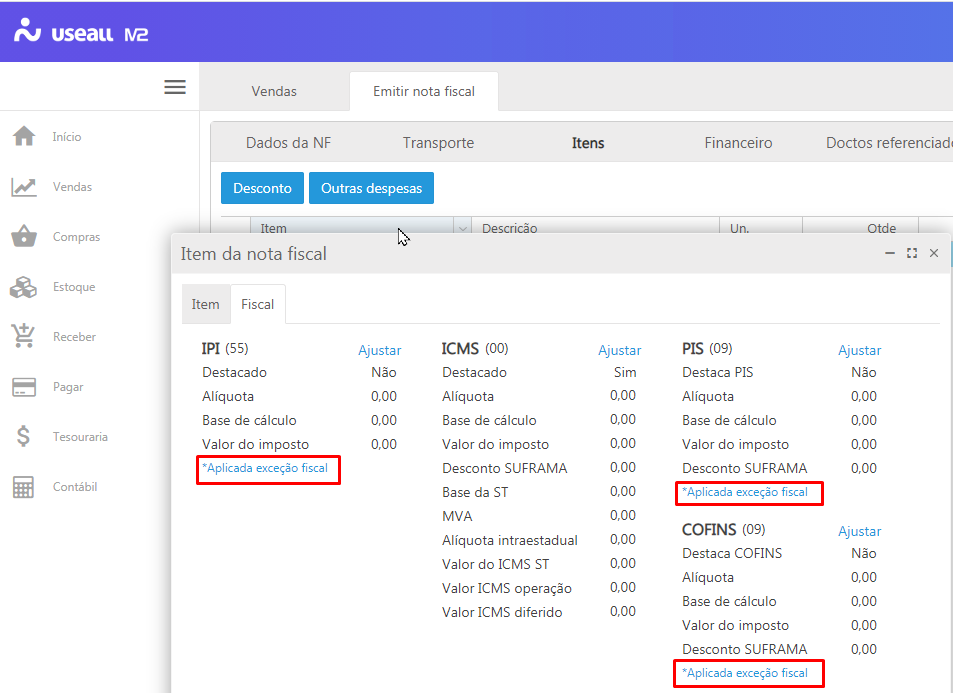

<!--**********************************************************************
##########################################################################
## Elaborado por      : Rafael Chagas       ######  Sprint: 08          ##
## Tempo de elaboração: 25/01 a 29/01/2021  ######                      ##
## Data da liberação  : 01/02/2021          ######  Hr liberação: 18:00 ##
## Desenv/atualizador : ISRAEL              ######  VERSÃO: 2.14.0/313  ##
##########################################################################
***********************************************************************-->

# Novidades da versão 2.14.0

Liberado em 01 de fevereiro 2021, a versão 2.14.0 com alterações e correções.

## **Outras Alterações**

<!--******************************************************************
                                VENDAS
********************************************************************-->
**<u>Clientes</u>**
<!-- CASO 665253 -->
Na tela de pesquisa do cadasto de clientes/ fornecedores, acessado em "Vendas> Clientes", foi adicionada a coluna "Vendedor" para demonstração do nome do vendedor.

Acesso em: Vendas > Clientes

**<u>Pedidos de venda</u>**
<!-- CASO 664608 -->
1- Para que todo o processo de faturamento ocorra de forma a não duplicar faturações, o sistema foi alterado para não permitir a adição do pedido mais de uma vez na "Caixa de Faturamento" (quando utilizado o acesso: "Mais opções> Emitir nota fiscal"), enquanto estiver em andamento o faturamento/conferência. Desta forma, há a exigência do término do faturamento atual ou seu cancelamento.

<!-- CASO: 664469 -->
2- Ao cadastrar o pedido de venda e utilizar a opção "Mais opções> Criar novo pedido com saldo", foi efetuado correção na geração do novo pedido e finalização do pedido existente.

3- Para o lançamento da nota fiscal de saída, o sistema foi alterado para permitir a emissão de NFC-e (Modelo 65) quando o cliente não possuir inscrição no cadastro nacional de pessoa física (CPF).

Para isso, foi adicionado na tela do cadastro de pedido de venda, o campo "Tipo identificação", que conterá as seguintes informações:

- "Cliente cadastrado"= será demonstrado quando o cliente cadastrado possuir o número do CPF em seu cadastro;
- "Consumidor identificado"=  quando o cliente possuir cadastro no sistema "Loja" com preenchimento do número do CPF;
- "Consumidor não identificado"= quando o cliente inserido não possuir o número do CPF;

Acesso em: Vendas > Pedidos

**<u>Caixa de faturamento</u>**
<!-- CASOS: 655968, 657821 -->
1- Quando há uma exceção fiscal para o lançamento do documento fiscal, o sistema buscará as informações do cadastro da exceção fiscal e não mais do cadastro do tipo de saída.

Desta forma, se configurada a exceção fiscal para o IPI, por exemplo, o enquadramento e CST serão demonstrados na nota fiscal de saída conforme inserido na exceção fiscal. 

2- Foi corrigida a demonstração do imposto ao editar o item da nota fiscal gerada. Quando vinculada exceção fiscal ao documento a ser emitido, o sistema demonstrará, na aba "Resumo" contida no item inserido na nota fiscal, a descrição "*Aplicada exceção fiscal".

Acesso em: Vendas > Caixa de faturamento

**<u>Nota fiscal de saída</u>**

No processo de emissão de notas fiscais de saída, a alteração foi realizada para demonstração das variáveis conforme descrito no cadastro de informações complementares.

Acesso em: Vendas > Notas fiscais de saída

<!--******************************************************************
                                COMPRAS
********************************************************************-->
**<u>Entradas</u>**
<!-- CASO 665117 -->
1- No processo de "Entradas" foi efetuado correção ao vincular o pedido de compra com conversão de unidade, para lançamento do documento fiscal de entrada. Desta forma, ao acessar "Compras > Mais opções > Entradas > Novo", inserir as informações e acessar aba "Itens", botão "Vincular pedido", será possível vincular o pedido de compra com conversão de unidade do item.

<!-- CASO 665044 -->
2- Ao inserir o número da chave NFe no processo "Compras> Entradas> Novo> Entradas", o sistema foi alterado para preencher os campos conforme as informações constantes na numeração.

<!-- CASO 665882 --> 
3- Ao lançar uma nota de entrada pelo processo de entrada, o sistema foi alterado para que a chave de NFe seja salva e visualizada na nota fiscal após finalizada.

Acesso em: Compras > Entradas

**<u>Nota fiscal de entrada</u>**
<!-- CASO 665882 -->
No processo de lançamento da nota fiscal de entrada de devolução, com acesso em "Compras > Notas fiscais de entrada > Novo > Nota fiscal de devolução", foi efetuado correção para que a chave NFe seja demonstrada na aba "Doctos vinculados" após processada a nota fiscal.

Acesso em: Compras > Notas fiscais de entrada

**<u>Importar XML da NFe</u>**
<!-- CASO 665046 -->
Foi efetuado correção nos procedimentos das informações no processo de importação de arquivos XML para as notas fiscais de entrada.

Acesso em: Compras > Importar XML da NF-e

<!--******************************************************************
                                ESTOQUE
********************************************************************-->

**<u>Extrato de estoque</u>**
<!-- CASO 665874 -->
Nos itens que possuem converão de unidade, foi efetuado correção no relatório "Extrato de estoque", para que esses itens sejam demonstrados corretamente na visualização quando emitido.

Acesso em: Estoque > Relatórios > Extrato de estoque

<!--******************************************************************
                                CONTÁBIL
********************************************************************-->
**<u>Lançamentos por centro de custos</u>**
<!-- CASO 644541 -->
No relatório "Lançamentos por centros de custos" foi efetuado correção para que sejam demonstradas as informações considerando a data de lançamento da nota fiscal de entrada.

Acesso em: Contábil > Relatórios > Lançamentos por centro de custo

