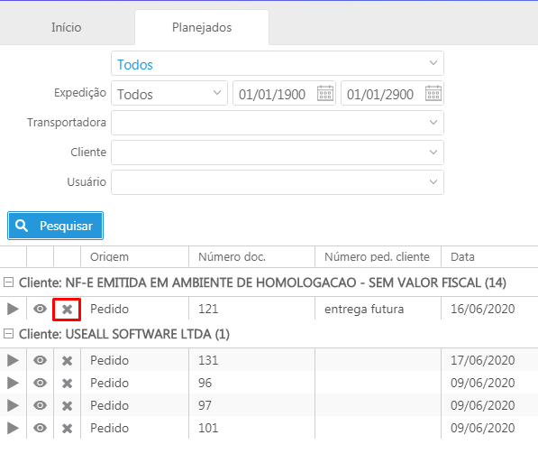

# Novidades da versão 2.4.1

Liberado em 07 de julho 2020, a versão 2.4.1 com algumas alterações e correções.

* [Gestão de entregas futuras](#gestao-de-entregas-futuras)

## **Novas funcionalidades**

### **Gestão de entregas futuras**  

Disponibilizado  processo de Gestão de entregas futuras: esse recurso serve para consultar as entregas realizadas pelo processo de faturamento antecipado e venda para entrega futura.

Acesso em: Vendas > Mais opções > Entregas futuras

## **Outras Alterações**

**<u>Solicitação de compras**</u> 

Disponibilizado opção de 'Alterar solicitação'. A alteração é possível somente nas solicitações com status: 'bloqueado', 'liberado' ou 'parcial'.

Acesso em: Compras> Solicitações de compra> Mais opções> Alterar solicitação

**<u>Proposta de venda**</u> 

1. Realizada melhoria na perfomance no rateio do frete.

2. Realizado correção na mensagem de alerta "Informe o CST do ICMS", no processamento com item do tipo Serviço.

3. Realizado melhorias para permitir alteração de todo o cenário. Se estiver com o status "Pendente", "Liberada" e "Parcial" é possível fazer a alteração de todo o escopo como incluir itens, alterar dados, reduzir quantidade, entre outros. Para tal, basta dar duplo clique na proposta.

4. Campo "Tipo de Operação" habilitado para digitação no lançamento de nova proposta e na alteração. Ao fazer isso o "Tipo de Saída" é atualizado com todas as opções atreladas ao "Tipo de operação".

5. Corrigido processo do botão de exclusão, onde ao excluir um item e adicionar um novo, o botão não ficava visível novamente.

Acesso em: Vendas > Propostas de venda 

**<u>Notas fiscais de entrada**</u> 

Efetuado correção de divergência de valor da nota de entrada: ao alterar os valores da base de cálculo do IPI manualmente ocorria mensagem 'Valor total a pagar informado nanota é de R$ X,XX, mas a soma das parcelas é R$ XX,XX. Diferença de R$ X,XX'.

Acesso em: Comprar > Notas ficais de entrada

**<u>Notas fiscais de saída:**</u>

Efetuado correção no processo de autorização da NF-e, onde ocorria rejeição devido ausência de informação no campo "Local de embarque", sendo que o mesmo não estava gravando as informações.

Acesso em: Vendas > Notas fiscais de saída > Mais opções > Alterar > Dados da nota

**<u>Emissão de notas**</u> 

Realizado correção no processo de Faturamento:
1. Com a Parametrização "Forma de cálculo da unidade tributável" marcada como "Peso Líquido" e com o "Peso Líquido" e "Peso bruto" definidos no item, o sistema rejeitava a nota no momento de autorização. Efetuado validação para autorizar a nota.

Acesso em: Vendas > Emissão de Notas fiscais

**<u>Montagem de Kit**</u> 

Correção na mensagem “Object reference” demonstrada ao processar o cadastro.

Acesso: Estoque> Mais opções> Montagens/ Desmontagens de kits

**<u>Processo de Adiantamento**</u> 

Realizado alteração no Processo de adiantamento. Quando o usuário realizava a devolução do valor parcial em dinheiro o sistema gerava um título de Contas a Pagar erroneamente.

Acesso em: Pagar > Contas a pagar

**<u>Baixa por encontro de contas**</u> 

Efetuado correção no processo de baixa por encontro de contas do Contas a pagar, onde ocorria mensagem Object reference não permitindo o processamento da baixa.

Acesso em: Pagar > Contas a pagar > Baixa

**<u>Expedição**</u> 

Efetuado melhorias e ajustes no processo:
1. Disponibilizado no cadastro de itens, aba Venda o campo "Embarca", que define qual item será demonstrado na expedição.
2. Correção na ação do botão "X", o sistema passa a desfazer a finalização da conferência ao invés de cancelá-la.
3. Foram removidos os parâmetros referentes ao "Embarque antigo".

Acesso em: Site de expedição - http://useallcloud.com.br/expedicao

**<u>Importação de XML da NF-e**</u>

Efetuado correção no processo:

Aba Identificação:
1. Ao efetuar o cadastro do fornecedor, ocorria a mensagem "Indique se este cadastro é para cliente, fornecedor ou ambos", não sendo possível efetuá-lo. Mapeado o CFOP do XML permitindo cadastrar o fornecedor.
2. Ao efetuar o cadastro do transportador, ocorria a mensagem: "O cliente está com o 'I.E' de 'Informada' e o campo 'Contribui ICMS' está marcado como 'não'". Corrigido processo permitindo cadastrar o transportador.

Acesso em: Compras > Importar XML da NF-e

**<u>Requisição de materiais**</u>

Disponibilizado processo de Transferência de requisição entre filiais, para enviar requisições abertas para outra filial.
Obs: Esse processo está disponível apenas para Requisições de origem Manual.

Acesso em: Estoque> Requisição de materiais> Mais opções> Transferir requisição para outra filial

**<u>Retorno bancário**</u>

Efetuado correção no processo de baixa de contas a receber pelo retorno bancário, onde não estava gerando o lote contábil da baixa.

Acesso em: Receber > Retorno bancário

**<u>Natureza Finaneira**</u>

Efetuado correção no comando alterar Natureza financeira nos processos:
1. Contas a receber 
2. Contas a pagar
3. Notas fiscais de saída
4. Notas fiscais de entrada
5. Nota fiscal de serviço
6. Lançamento CT-e
7. Movimento financeiro

Acesso em: Selecionar o registro > Mais opções > Alterar > Natureza financeira

**<u>Orçamento Empresarial**</u>

Realizado correção no processo de Importação de planilha no Orçamento Empresarial, permitindo concluir a importação.

Acesso em: Contábil > Orçamento Empresarial

**<u>AVT**</u>

Realizado correções no processo de Orçamento:
1. No cadastro de Orçamento, aba AVT > Modelagem, no cadastro de Machos,  o sistema não estava gravando a informação do Tipo de Material.
2. Na aba Terceirização, ao marcar alguns ensaios como terceirizados, não estava trazendo a descrição dos ensaios a serem realizados.
3. Na aba AVT > Fusão foi inserido o campo "Peso estimado".

Acesso em: Vendas > Orçamentos

**<u>Relatório de Faturamento**</u>

Efetuado correção no relatório de Faturamento:
1. Inserida as colunas "Peso Líquido" e "Peso Bruto".
2. Preencher essas colunas com os dados da nota fiscal.

Acesso em: Vendas > Relatórios > Faturamento > Modelo - Padrão

**<u>Caixa de entrada**</u> 

Corrigo processo de Integração de Pedidos com o Portal de representante, onde ocorria mensagem de erro, não permitindo o processo.

Acesso em: Vendas > Listas > Caixa de entradas

