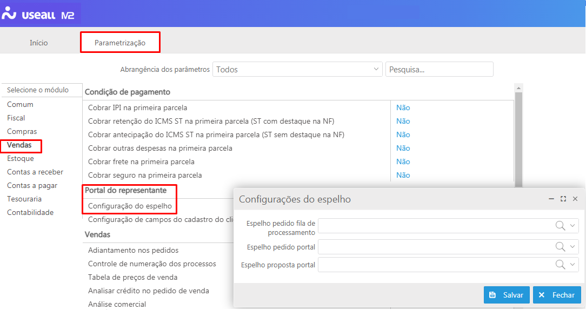

<!--**********************************************************************
##########################################################################
## Elaborado por      : Rafael Chagas       ######  Sprint: 09          ##
## Tempo de elaboração: 02/02 a 02/02/2021  ######                      ##
## Data da liberação  : 02/02/2021          ######  Hr liberação: 18:00 ##
## Desenv/atualizador : ISRAEL              ######  VERSÃO: 2.14.1/315  ##
## -------------------------------------------------------------------- ##
##                              Descrição                               ##
## -------------------------------------------------------------------- ##
## Início da nova sistemática de liberações contínuas das alterações.   ##
## A partir desta versão, as liberações serão diárias e não teremos     ##
## sprint, apenas os WI liberados. A versão será incrementada todo dia  ##
## com as liberações.                                                   ##
##########################################################################
***********************************************************************-->

# Alterações liberadas 

A partir desta versão teremos uma novidade: as liberações de alterações e/ ou correções passam a ser diárias. Desta forma, praticidade e agilidade trarão a continuidade nos trabalhos sem interrupção no fluxo.  
Veja abaixo as alterações liberadas.

* [Fevereido - Semana 01](#dia-02-de-fevereiro)

**Fevereiro - Semana 01**
Liberadas as versão 2.14.1 a 2.15 entre os dias 01 a 05 de fevereiro.

<u>Liberações do dia 02/ 01</u>

Disponibilzada a parametrização "Configuração do espelho" para permitir a inserção dos modelos de espelho para impressão no sistema "Portal do Representante". Os espelhos disponibilizados são: "Espelho pedido fila de processamento", "Espelho pedido portal" e "Espelho proposta portal".

> Esta configuração é válida para os usuários que possuem acesso ao sistema "Portal do representante".

Acesso em: Início > Parametrização > Vendas > Portal do representante

<!--******************************************************************
                                VENDAS
********************************************************************-->
**<u>Notas fiscais de saída</u>**

Na tela de pesquisa das notas fiscais de saída, foi realizado correção na emissão de etiqueta, localizado em "Mais opções> Imprimir - Etiquetas". 

Acesso em: Vendas > Notas fiscais de saída

**<u>Pedidos de venda</u>**
<!-- CASO 66139 -->
No processo de cadastro de pedido de venda, quando alterado o tipo de saída, o sistema zerava o campo "Preço RS" e não alimentava com base na parametrização do novo tipo de saída inserido. Desta forma, foi efetuado correção quando utilizado a opção "Alterar > Itens", disponível no botão "Mais opções", para o correto preenchimento das informações.

Acesso em: Vendas > Pedidos de venda > Mais opções > Alterar

**<u>Relatórios</u>**
<!-- CASO 666115 -->
1- Para a correção emissão do relatório "Análise ABC de NFS por item", foi efetuado correção nos parâmetros de demonstração das informações.

Acesso em: Vendas > Relatórios > Análise ABC de NFS por item

2- Disponibilizados os relatórios "Evolução do faturamento" e "Faturamento por grupo de item e filial" para demonstração das informações de faturamento.

> Os relatórios demonstrarão os valores de acordo com o somatório líquido dos itens contido nas notas fiscais de saída e consideram os valores das notas fiscais de serviço.

Acesso em: Vendas > Relatórios > Gráficos faturamento

<!--******************************************************************
                                ESTOQUE
********************************************************************-->
**<u>Suprimento de almoxarifado</u>**

O processo de Suprimento de Almoxarifado foi alterado para que seja considerado o valor da coluna "Compras previstas" com base na filial de Destino.

Acesso: Estoque > Mais opções

<!--******************************************************************
                                CONTÁBIL
********************************************************************-->
**<u>Exceção fiscal</u>**

No processo de cadastro da exceção fiscal, a correção foi realizada com relação ao cadastro de novos registros com informações semelhantes e critérios de UF's diferentes. Com isso, a validação de duplicidade ocorrerá somente com as informações iguais para todo o cadastro.

Acesso em: Contabilidade > Listas > Exceção fiscal de ICMS. 

<!--**********************************************************************
##########################################################################
## -------------------------------------------------------------------- ##
## Elaborado por      : Rafael Chagas       ######  Sprint: 09          ##
## Elaboração dia     : 03/02/2021          ######                      ##
## Data da liberação  : 03/02/2021          ######  Hr liberação: 12:00 ##
## Desenv/atualizador : ISRAEL              ######  VERSÃO: 2.14.2/315  ##
## -------------------------------------------------------------------- ##
##########################################################################
***********************************************************************-->

<u>Liberações do dia 03/ 01</u>

**<u>Almoxarifados</u>**

No processo de cadastro de almoxarifado, a descrição do campo "Soma ao saldo de estoque" foi alterada para "Considerar na Nec. compra". 

Acesso em: Estoque > Almoxarifados

<!--******************************************************************
                        NOVAS FUNCIONALIDADES
********************************************************************-->

<!--******************************************************************
                                INÍCIO
********************************************************************-->

<!--******************************************************************
                                VENDAS
********************************************************************-->

<!--******************************************************************
                                COMPRAS
********************************************************************-->

<!--******************************************************************
                                ESTOQUE
********************************************************************-->

<!--******************************************************************
                                RECEBER
********************************************************************-->

<!--******************************************************************
                                PAGAR
********************************************************************-->

<!--******************************************************************
                                TESOURARIA
********************************************************************-->

<!--******************************************************************
                                CONTÁBIL
********************************************************************-->

