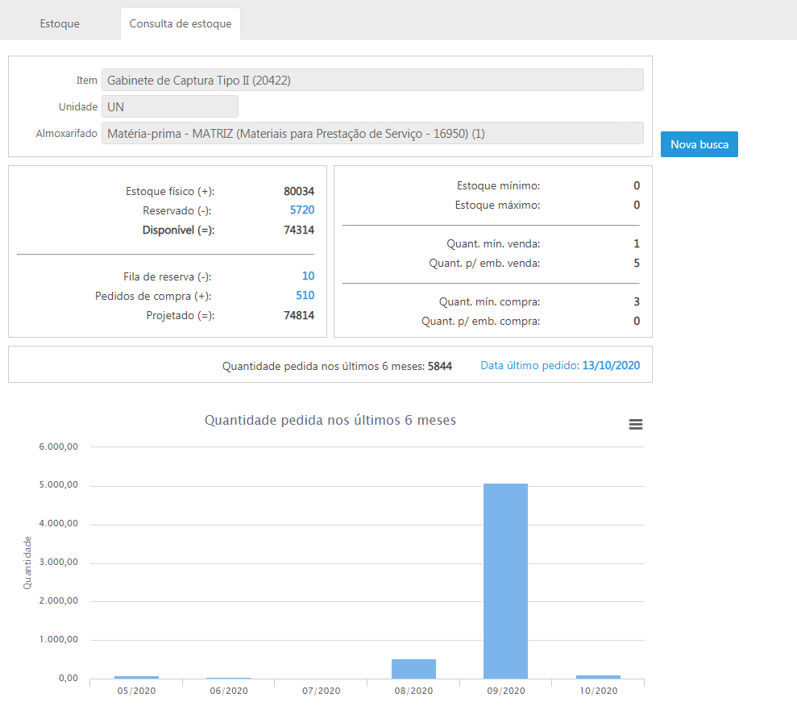

# Estoque

**Consulta de estoque**  

Disponibilizado o processo de Consulta de estoque, uma ferramenta para gestão das informações de estoque para vendedores/representantes.

Imagine que seu cliente pediu um determinado produto, você abre o sistema e ele informa que tem o produto disponível em outra loja. Opcionalmente você pode informar que possui o produto e vai chegar em 10 dias. 
Essa nova ferramenta fornecerá esse tipo de informação para os vendedores e representantes. Nessa tela, você poderá escolher um item e o sistema mostrará várias informações sobre ele, tais como estoque, reservas, pedidos de compra, entre outros. 

Para saber mais clique [aqui](../Versões/2.0/versao_2.7/2.7.0-303.md).
